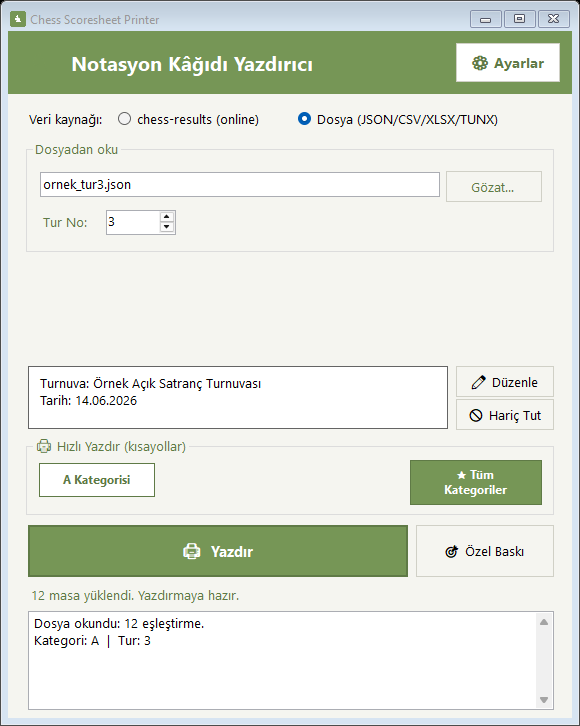
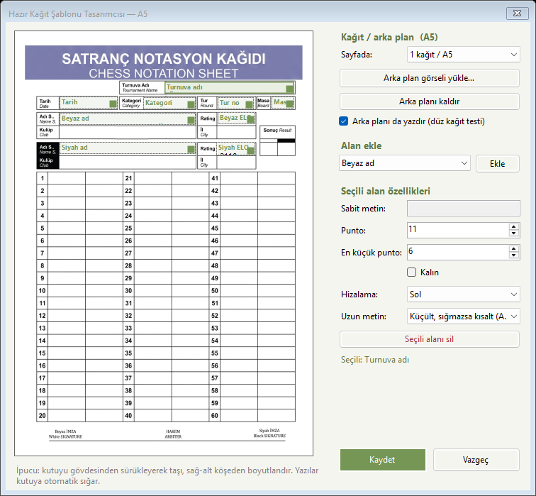

# Chess Scoresheet Printer

[Türkçe](README.md) | English

Chess Scoresheet Printer is a Windows desktop tool for placing tournament pairing information on pre-printed chess scoresheets. It works with Chess-Results and Swiss-Manager exports.

The application is used at tournaments run by two provincial organizations of the Turkish Chess Federation. It is an independent project and is not an official application of the federation.

  

## Main functions

- Search tournaments and retrieve pairings from Chess-Results
- Import JSON, CSV, TXT, XLSX and TUNX files
- Batch-print by round or category
- Create print templates for pre-printed scoresheets
- Adjust field positions and text sizes
- Configure excluded boards, copy count and page size
- Print preview and PDF output

## Usage

1. Select a Chess-Results tournament or open a pairing file.
2. Select the category and round.
3. Choose the appropriate scoresheet template.
4. Review the print preview, then print directly or create a PDF.

The template editor allows tournament, date, category, round, board and player fields to be positioned separately.

  

## Download

The Windows x64 package is available on the [Releases](https://github.com/TunahanDilercan/chess-scoresheet-printer/releases/latest) page. After extracting the ZIP archive, run `ChessScoresheetPrinter.exe`. The package includes the .NET runtime and is intended for Windows 10 and Windows 11.

The published executable is not code-signed, so Windows may display a SmartScreen warning on first launch.
