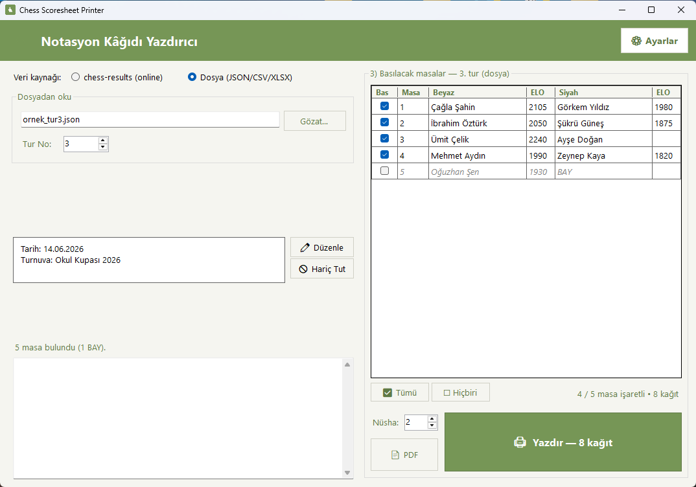
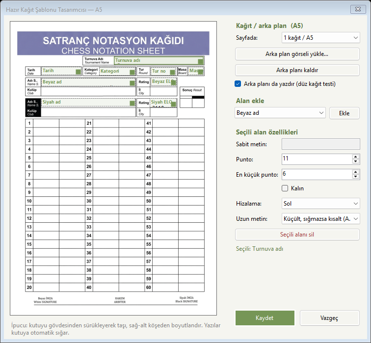

# Chess Scoresheet Printer

[Türkçe](README.md) | English

Chess Scoresheet Printer is a Windows desktop tool for placing tournament pairing information on pre-printed chess scoresheets. It works with Chess-Results and Swiss-Manager exports.

The application is used at tournaments run by two provincial organizations of the Turkish Chess Federation. It is an independent project and is not an official application of the federation.

  

## Main functions

- Search tournaments and retrieve pairings from Chess-Results (byes and unpaired players are recognised)
- Per-category system support: Swiss, round robin (Berger) and team tournaments, read from each category's "tournament type"
- Team matches: board numbers such as "1.2" and team names (printed in the Club boxes)
- Quick-access buttons showing each category's latest round and printing it in one click (F5 refreshes them all)
- Bye boards are not printed by default, only when ticked manually in the list
- Tournament regulations/report: the built-in template or your own .docx is filled with Chess-Results data, missing details are asked step by step; output as PDF, to a printer or as Word
- Category table cards (A4): tournament poster at the top, large category name on a category-coloured band; copies default to the category's board count
- Import JSON, CSV, TXT and XLSX files
- Choose the boards to print by ticking them in a list (remembered separately for each category and round)
- Batch-print by round or category
- Create print templates for pre-printed scoresheets
- Adjust field positions and text sizes
- Printer alignment offset (mm) with an alignment test page
- Configure excluded boards, copy count and page size
- Print preview with a faded scoresheet background, and PDF output

## Usage

1. Select a Chess-Results tournament or open a pairing file. Choosing a province opens its most recently added tournament automatically; search and link/number also work.
2. Select the category and round. Pairings load into the list on the right automatically; the default round is the latest round with published pairings (for round robins, the first round without results). A quick-access button (e.g. "🖨 7 Yaş · T2") sends that category's latest round straight to printing. Press F5 after a new round is published to refresh every button.
3. Untick boards that should not be printed and set the number of copies (default 4). Selections are remembered, and "All categories" and the quick-access buttons respect them.
4. Press **Print** (Ctrl+P) to open the preview. The pre-printed sheet is shown faded in the preview but is never printed. Choose a printer and print; selections and filters stay as they were.

The **📄 Yönerge / Rapor** button in the header fills the regulations template with tournament details from Chess-Results (dates, venue, system, time control, categories, director, chief arbiter, round schedule). Details that cannot be found (registration deadline, phone, …) are asked step by step, and contact details are remembered for the next report. You can upload your own .docx template: markers such as `{{IL}}` and `{{YER}}`, or labelled table cells such as "İLİ | …", are filled in. Converting to PDF and printing require Microsoft Word; without Word the document is saved as .docx.

**🏷 Masa Kartları** prints an A4 card for each category. Each category gets its own colour, which is remembered and can be changed in the table.

If the text is offset from the boxes on the pre-printed sheet, correct it in millimetres under **Settings → Printer alignment** and check it with the **alignment test** page; the template itself does not need to change. Venue, arbiter and time-control details are intentionally not printed.

The template editor allows tournament, date, category, round, board, player and team fields to be positioned separately. The default template is "Ana Örnek 2"; the previous layout remains available as "Ana Örnek". **Settings → Template by system** lets Swiss, round-robin and team categories use different templates.

  

## Download

The Windows x64 package is available on the [Releases](https://github.com/TunahanDilercan/chess-scoresheet-printer/releases/latest) page. After extracting the ZIP archive, run `ChessScoresheetPrinter.exe`. The package includes the .NET runtime and is intended for Windows 10 and Windows 11.

The published executable is not code-signed, so Windows may display a SmartScreen warning on first launch.
